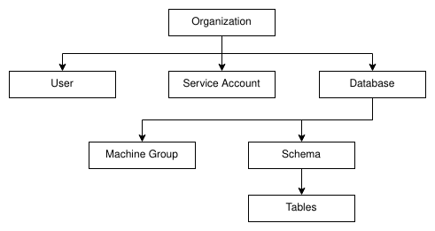

# Cloud Architecture

This document attempts to describe how GlareDB the database will integrate with
the cloud product.

This is a living document and should be updated as we continue to gather
requirements.

## Requirements

High-level requirements for the cloud product.

- A user can create and scale a database with varying machine configuration
  options. "Scale" here means being able to reconfigure and existing database
  either by altering the number of nodes deployed, or changing the regions that
  the database exists in.
- A machine (or group of machines) can either be created/configured as
  "read-only" or "read-write".
- A database can be scaled up or down.
  - Scale down to zero is nice, but not necessary.

## Concepts

Logical concepts on the platform.

### Object Hierarchy



#### Organizations

The top-most unit of organization. An organization has exclusive ownership of
zero or more databases. A user may belong to zero or more organizations. An
organization must have at least one user.

#### Users/Service Accounts

A user may have permissions granting them access to databases, schemas, and tables.

Service accounts provide credentials for external applications to connect to
databases. Access controls will be very similar to users.

#### Machine Groups

Machine groups are a way of having a set of machines for different
workloads[^engines]. In particular, we'll want to want to have "read-only"
groups, and "read-write" groups, where each group can be scaled independently to
cater to specific OLAP and OLTP use-cases.

Read-write machine groups take complete ownership of a bucket in object storage.
The local disk acts as a long-lived cache. Since each node has its own bucket,
each bucket will contain duplicated data. Object storage is cheap, so this is
not too much of a drawback, and it should make implementation easier.

For MVP, we shall assume that a database will only have one read-write machine
group. All subsequent machine groups are read-only and act as Raft learners in
the cluster.

#### Schemas/Tables

User data.

## Assumptions/Priors

- Persistent storage is cheap.
  - $0.17 per GB for SSD
- Object storage is even cheaper.
  - ~$0.02 per GB
- Networking is cheap, but can easily bite us if we're not careful.
  - $0.01-$0.15 per GB for inter-region depending on region.
  - $0.01 per GB for inter-zone within same region.
  - Free for intra-zone transfer.

## Overview

Note that this section is closer to the end-vision of GlareDB Cloud.


_[Diagram Source](https://app.diagrams.net/?src=about#G1yt0JsWNlk2JHom3IcyEGlDgONvQhwavL)_

## Control Plane

### Control Plane Proxying

For the most part, the control plane acts as a simple proxy for connections
originating from user applications.

A connection string might look like the following:

``` text
postgresql://<USER>:<PASSWORD>@region-a.cloud.glaredb.com:6543/<database>?sslmode=verify-full?options=--group%3D<machine-group>
```

Every region that we support will have a unique DNS, e.g. for "region-a" it
would be `region-a.cloud.glaredb.com`.

From this string, we can get the following info:

- The SQL user
- The password for the SQL user
- A machine group (see [Machine Groups](#machine-groups))

The first step for proxying will be to ensure credentials are correct, then to
check if the database exists for that user. This will involve reaching out to
the Postgres database, which may have a not insignificant amount of latency, but
this is acceptable given that this check only happens once per connection.

Once we verify credentials and that the database is up and running, we proxy the
connection to the database. This connection is long-lived but stateless. We can
assume that we deploy new versions of the control plane that client connections
will automatically reconnect.

### Lifecycle Management

When a user requests to create a database, the control plane will spin up
kubernetes pods as necessary. If the user requests a multi-region deployment,
the control plane will communicate with other control planes in the regions of
interest. Scaling and delete requests will follow a similar flow.

#### Startup Parameters

On startup, a compute node will be provided with information for connecting to
an already existing databases cluster or initializing a cluster.

### Catalog Integration with the Control Plane

Some catalog operations will require that the database servicing the request
reaches out to the control plane. In particular, the following operations will
be of concern:

- `CREATE DATABASE ...`
  - Create a new database with the provided options. This is a logically and
    physically separate database from the current database.
- `CREATE USER ...`
  - Create a new user with the provided options and permissions.
- Check user access
  - A user may have restricted access to tables and/or schemas. During query
    planning, we'll need to ensure that the user executing query has the
    appropriate access for the requested tables/columns.
  - To avoid making an external request for every query, this will be cached
    initially. Eventually we could have the control plane notify databases of
    permission updates.
- Scale requests
  - Allow users to spin up machine groups. See [Firebolt's `CREATE ENGINE`](https://docs.firebolt.io/sql-reference/commands/create-engine.html)
    for an example of what we might want to expose in SQL.

## Backend API

The backend API itself will be relatively straightforward. Long-running
operations will be dumped off to the relevant control plane code.

Database introspection (e.g. getting a list of schemas/tables) will be done
through connected to a relevant database node.

[^engines]: Somewhat analogous to Firebolt's Engines.
